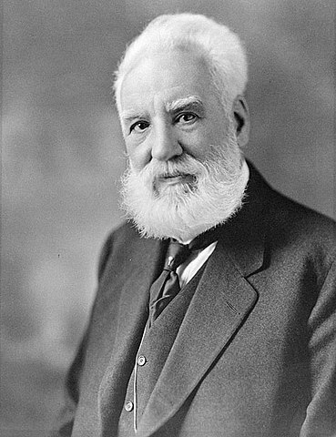
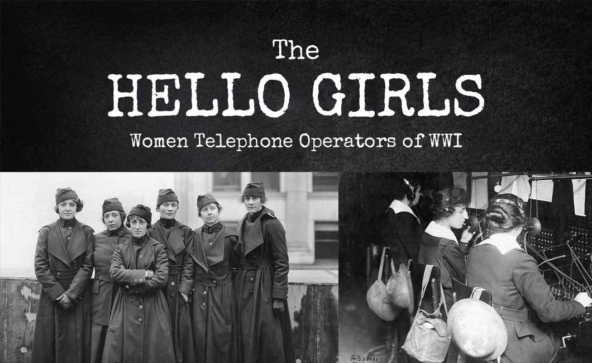
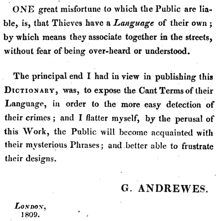
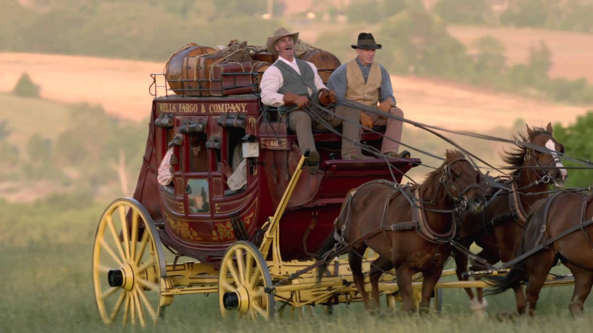
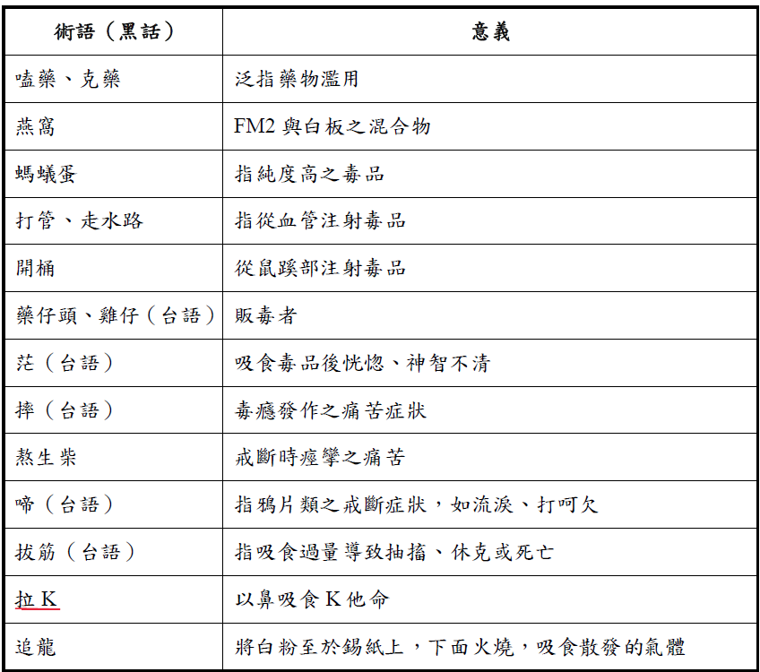
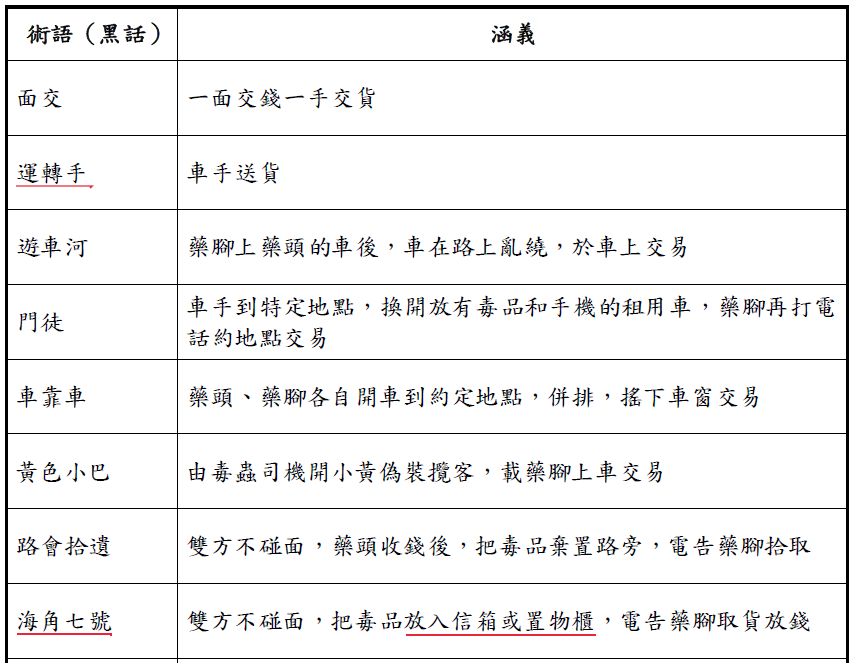

```{r setup, include=FALSE}
knitr::opts_chunk$set(echo=FALSE, message=FALSE, warning=FALSE, comment="")
library(widgetframe)
knitr::opts_chunk$set(widgetframe_self_contained = FALSE) 
knitr::opts_chunk$set(widgetframe_isolate_widgets = TRUE) 
knitr::opts_chunk$set(widgetframe_widgets_dir = 'widgets' )
```

Hello
==================
<br><br><br><br><br><br><br><br><br><br><br><br><br>
[Progress through technology (19th century)]{.white}


## H-words

- Catch each other’s attention

    > - **Hey**, **Ho**: 13th century

    > - **Hi**: 15th century

    > - **Hollo**, **Hillo**, **Holla**, **Halloo**: 16th century  
    &nbsp;&nbsp;[Shouts used in hunting]{.gray}

- Greetings

    > - **Hal**: Be healthy
 
    > - **Hail**: 13th century

## *Hello*

- Spelling Difference
    - Hallo, Hello, Hillo, Hollo, Hullo  
    &nbsp;&nbsp;[Stress was on the second syllable, <br>difficult to hear the quality of the first vowel.]{.gray}

    - Google Ngram Viewer  
<iframe name="ngram_chart" src="./ngram1.html" width=100% height=60% marginwidth=0 marginheight=0 hspace=0 vspace=0 frameborder=0 scrolling=no></iframe>


## How *Hello* became Popular

- Early 1800s: informal, street slang

- **Telephone**

    > - 1876: Invented by *Alexander Graham Bell* (Not *Edison*)
    
- Need a way of starting a conversation

- **Thomas Edison**

    > - Prefered Hello:  
[Shouted 'Hello' ('Halloo') into the mouthpiece when testing a phonograph (留聲機)]{.gray}
    
    > - A letter (1877) used **Hello**:  
["I don't think we shall need a call bell, as 'Hello!' can be heard 10 to 20 feet away. What do you think?"]{.gray}


## Bell & Edison

<div class="column-2">



</div>

## Hello Girls

- 


## *Hi*{.smaller}

> - USA: 19th century

> - Widely spread

- Replace Hello?

    > - Common in Email
    > - Easier to type than 'Hello'

- 
<iframe name="ngram_chart" src="./ngram2.html" width=100% height=60% marginwidth=0 marginheight=0 hspace=0 vspace=0 frameborder=0 scrolling=no></iframe>

Disinterested
==================================
<br><br><br><br><br><br><br><br><br><br><br><br><br>
[A confusible (17th century)]{.white}

## Interest (名詞)


- 15th Century

    > - 擁有權  
    [have an interest in an estate]{.gray}

    > - 股份  
    [hold an interest in a company]{.gray}
    
    > - 好處、利益  
    [It’s in your interest to vote for me]{.gray}

- 17th Century: 興趣、嗜好

## Interested (形容詞)


```{r out.width="100%"}
library(DiagrammeR)
mermaid('
graph LR

subgraph 
d("感興趣的") --> c("有利害關係的")
end

subgraph 
A(擁有權)-->B(股份)
B-->C("好處、利益")
C-->D("興趣、嗜好")
end

C -.-> c
D -.-> d

style A fill:#f8766d
style B fill:#f8766d
style C fill:#f8766d
style D fill:#f8766d

style c fill:#00bfc4
style d fill:#00bfc4
')
```


## **Dis-** vs. **Un-**


- **Dis-** only

    > - Discontent vs. ~~Uncontent~~

- **Un-** only

    > - ~~Discomfortable~~ vs. Uncomfortable

<br>

- **Dis-** & **Un-** with **different** meanings

    > - Disterested vs. Uninterested

- **Dis-** & **Un-** with **overlapping** meanings

    > - Disterested vs. Uninterested

## History: **Dis**interested vs. **Un**interested

```{r}
source("plot.R")
```

```{r}
frameWidget(line_dis_un, height = 300)
```

- **1750**: Meanings completely overlap


## Modern: **Dis**interested vs. **Un**interested

- Uninterested: bored, unconcerned

- Disinterested: impartial, bored('incorrect', [Oxford](https://en.oxforddictionaries.com/usage/disinterested-or-uninterested){target="_blank"})


<div class="columns-2">
```{r, out.width="80%"}
pie_US
```

```{r, out.width="80%"}
pie_UK
```    
</div>


Dragsman
==================================
<br><br><br><br><br><br><br><br><br><br><br><br><br>
[Thieves’ cant (19th century)]{.white}


## *A Dictionary of the Slang and Cant Languages*

> - George Andrewes, 1809

> - (Hope to) Make it easier to detect crimes  



## Dragsman

> - Drag (18th 世紀): Horse-drawn wagon

- 

- Dragsman
    - 車夫
    - one who stole goods or luggage from vehicles


## Cant Languages still used today

> - footpad: one who robs pedestrians

> - water-pad: One who robs ships

> - coiner: 偽造貨幣者


## 臺灣黑話

- 吃土豆 (閩南語)?

- 食品藥物管理署: 毒品相關術語


## 毒品術語 (使用)




## 毒品術語 (交易)


