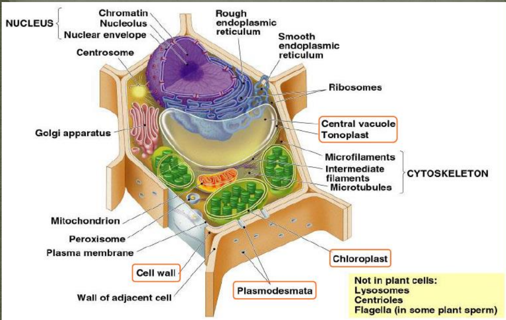
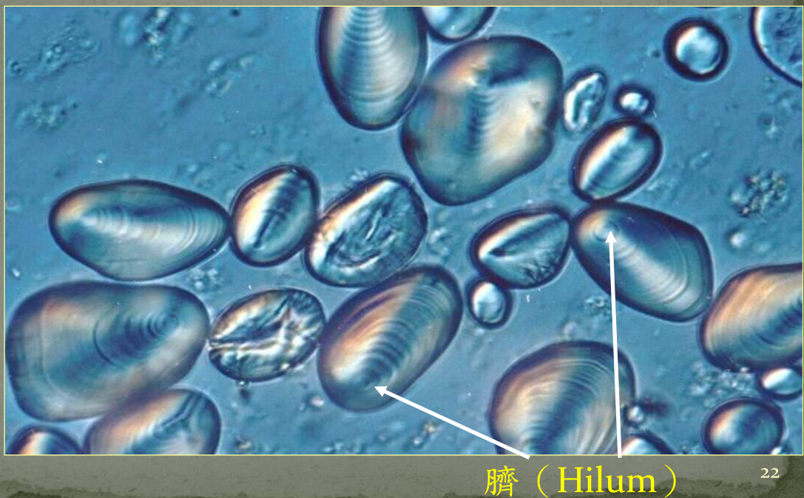
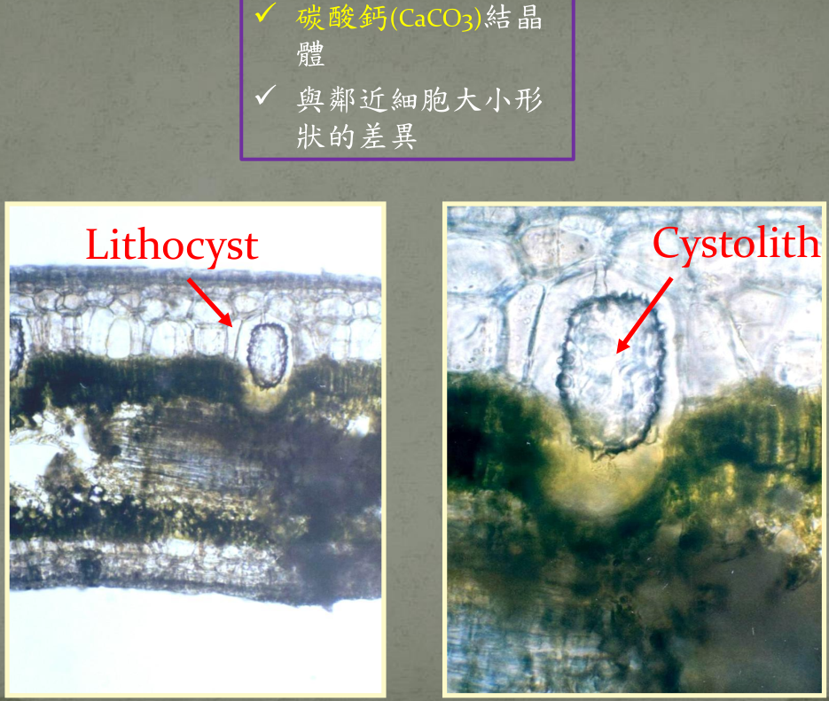
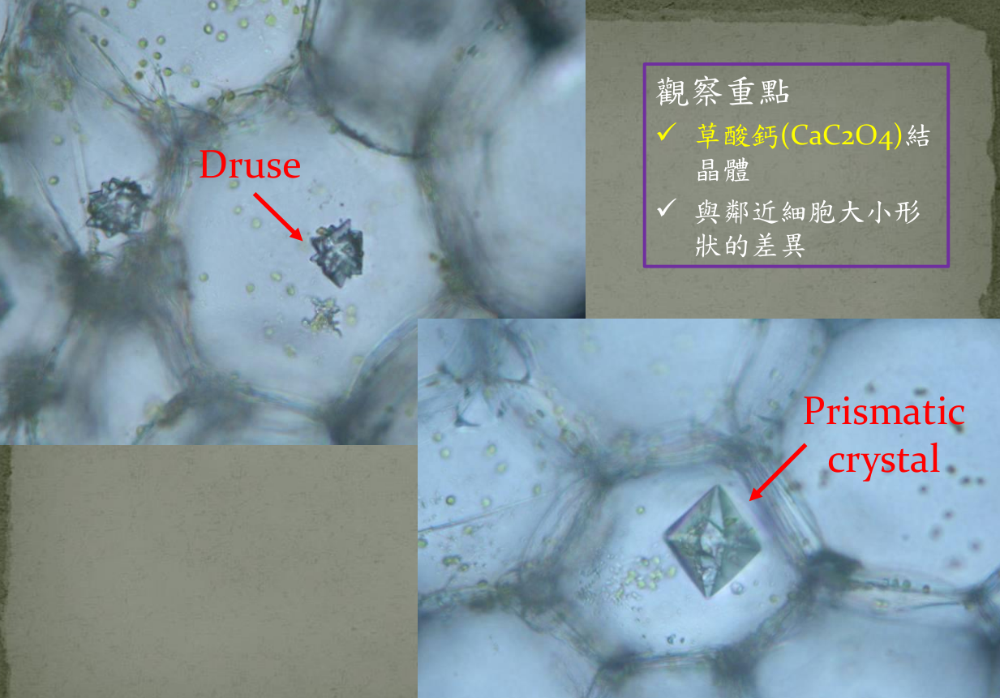

{:width="60%" height="60%"}

Vacuole, Chloroplast, 水蘊草: Cytoplasmic streaming(細胞質回流)

hypertonic solution(高張), hypotonic solution(低張) , isotonic solution(等張)

- plasmolysis: 質離現象

Chromoplast(雜色體)

- 雜色體因含有[胡蘿蔔素](https://zh.wikipedia.org/wiki/%E8%83%A1%E8%98%BF%E8%94%94%E7%B4%A0)（Carotene）、[類胡蘿蔔素](https://zh.wikipedia.org/wiki/%E9%A1%9E%E8%83%A1%E8%98%BF%E8%94%94%E7%B4%A0)（Carotenoid）、[番茄紅素](https://zh.wikipedia.org/wiki/%E7%95%AA%E8%8C%84%E7%B4%85%E7%B4%A0)（Lycopene）、[辣椒紅素](https://zh.wikipedia.org/wiki/%E8%BE%A3%E6%A4%92%E7%BA%A2%E7%B4%A0)（Capsanthin）等色素而呈紅色、橘色或黃色，其中類胡蘿蔔素占一半以上。雜色體是進行生產與儲存色素的場所，為多數植物[花瓣](https://zh.wikipedia.org/wiki/%E8%8A%B1%E7%93%A3)及[果實](https://zh.wikipedia.org/wiki/%E6%9E%9C%E5%AF%A6)的顏色來源。

分裂中的細胞，核佔細胞的比例大

成熟細胞，液胞佔細胞的比例大

## 後生物質

### 澱粉粒

{:width="60%" height="60%"}

### 結晶體

{:width="60%" height="60%"}

Tradescantia virginiana 紫鴨跖草

{:width="60%" height="60%"}

{:width="60%" height="60%"}

秋海棠(Begonia sp.)葉柄

{:width="60%" height="60%"}
