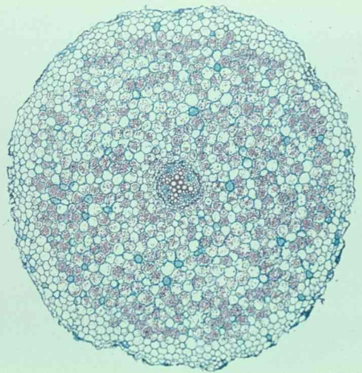
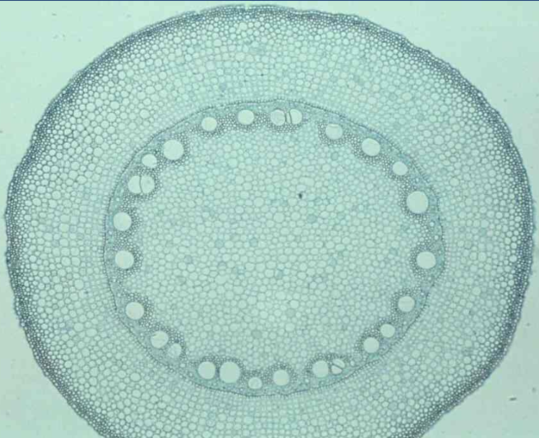
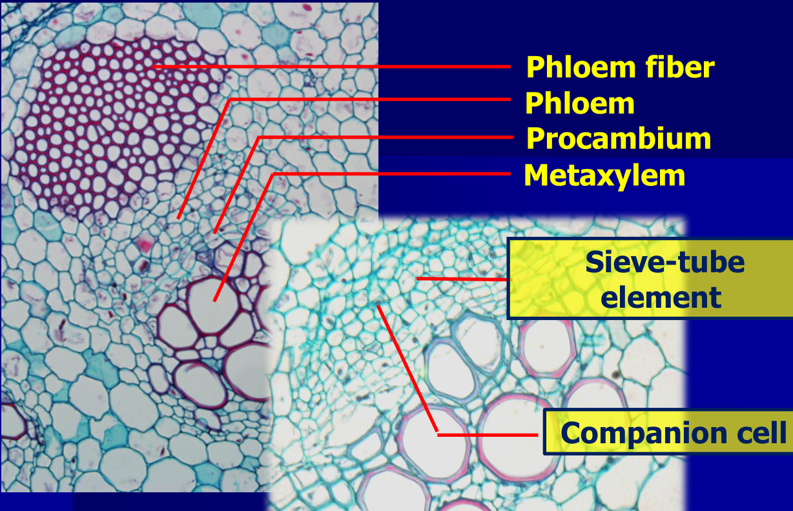
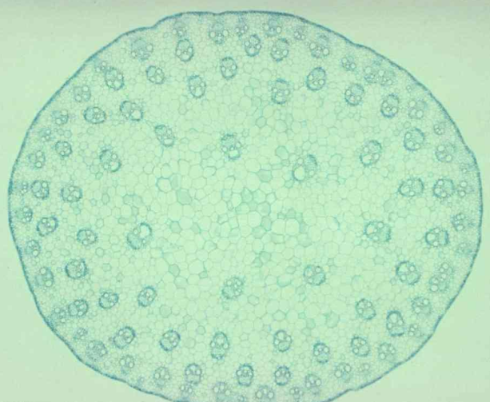

**雙子葉**植物及**裸子**植物根系: Tap root system

stele(中柱)最外層: 周鞘(pericycle)

**單子葉**: Fibrous root system

## 根

### 雙子葉根

{:width="60%" height="60%"}

C.S. of root of Ranunculus sp.(毛艮) **雙子葉根**
外而內: epidermis(表皮) -> cortex(皮層) > `內皮層(endodermis)` -> `周鞘(pericycle)` > stele(中柱)

### 單子葉根

{:width="60%" height="60%"}

C.S. of root of Zea mays(玉米)
epidermis -> cortex -> vascular cylinder -> pith(髓)

{:width="60%" height="60%"}

## 莖

**早成**木質部 (**protoxylem**)，細胞較小位於外緣

較**晚成熟**的稱為**晚成木質部** (**metaxylem**)

### 雙子葉莖

C.S. of stem of Helianthus annus (向日葵)

epidermis -> cortex -> vascular bundle -> pith

{:width="60%" height="60%"}

## 單子葉莖

{:width="60%" height="60%"}

C.S. of stem of Zea mays
epidermis -> vascular bundle in ground tissue

{:width="60%" height="60%"}

## 葉

### 雙子葉

- 完全葉 (perfect leaf): 葉具有**葉身** (blade)、**葉柄** (petiole) 和**托葉** (stipule) 
- 缺少其中任一部份者即為不完全葉 (imperfect leaf)。

- 一枚葉柄上只著生一葉片者稱為單葉 (simple leaf)
- 一枚葉柄上有多數小葉片(leaflet) 者稱為複葉 (compound leaf)
  - **羽狀複葉** (pinnately compound leaf): 葉軸 (rachis) 的兩側成羽狀
  - **掌狀複葉**(palmately compound leaf): 小葉的基部集生於葉柄的頂端展開如掌狀

### 單子葉

- **葉鞘** (sheath)、**葉身**和**葉舌** (ligule)

葉在**莖上排列**的方式稱為**葉序** (phyllotaxy)

- 互生(alternate): 每一節上只生**一葉**
- 對生(opposite): 每一節上生**兩葉**
-  輪生(whorled) : 每一節上生有**三葉或三葉以上**圍繞成**輪狀**

一節上生兩葉